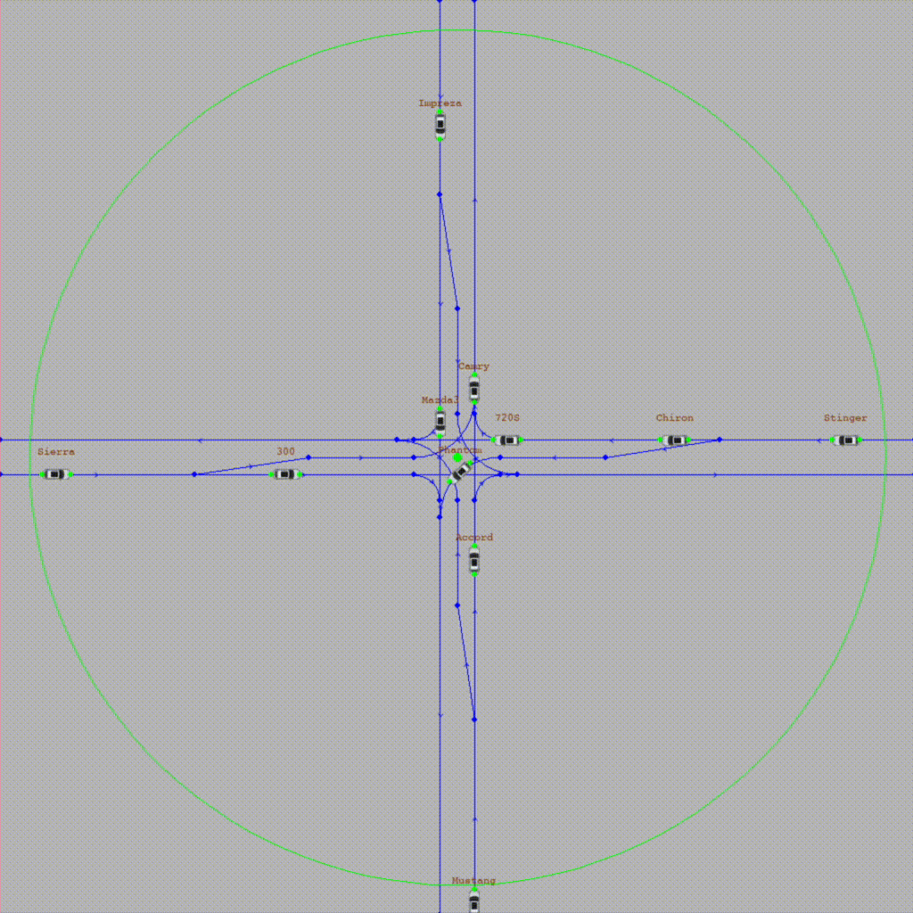

# Concurrent Traffic

Concurrent Traffic is a traffic simulator that runs a ***queue-based greedy algorithm*** which manages self-driving cars and eliminates the need for traffic lights completely. The algorithm enables intersections to flow in all directions simultaneously. As a result, it is significantly faster than a standard traffic light system and fully eliminates the possibility of congestion.

Traffic concurrency is achieved by a central manager which asserts control over vehicles entering its radius. Using its context of vehicle trajectories, the manager computes and sends acceleration commands to orchestrate a harmonious set of vehicular pathings free of collisions.

*Demonstration of concurrent-traffic algorithm*

**Simulator Features:**

- Playback Controls
- Zoom
- Presets
- Advanced Logging
- Algorithm Selector
- Standard Traffic Simulation Mode *(WIP)*
- Intersection Points calculation
- Parametric Routing (Nodes, Edges)

**Algorithm Features:**

- Max Acceleration Speed and Top Speed (Comfort)
- Minimum Safety Distance (Safety)
- Desired Cruising Speed (Speed)
- Manager Radius (Area of Control)
- Flexible to Different Intersection Layouts

**Libraries/Technologies:**

- SciPy
- NumPy
- PyGame
- JSON
- Makefile
